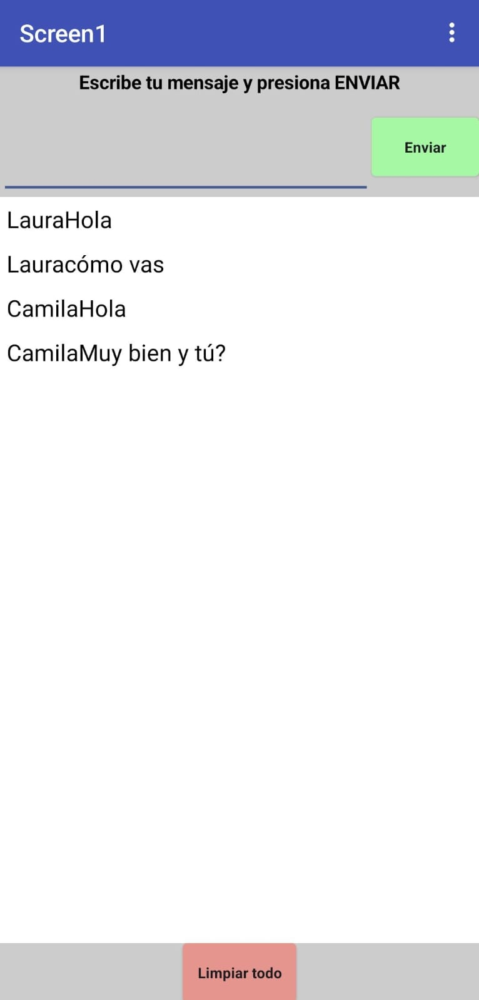

# 💬 michat App

## ¿Qué es esta app?
**michat** es una aplicación móvil creada con **MIT App Inventor 2** como parte del curso de **Introducción a Ciencia de Datos con Tecnolochicas**.

La app permite a personas **comunicarse mediante un chat**, ingresando su nombre y enviando mensajes que se **almacenan en la nube** utilizando **CloudDB**.

---

## Cómo interactúa el usuario
- Ingresar su **nombre de usuario** en el campo correspondiente.  
- Escribir un mensaje en el cuadro de texto.  
- Enviar el mensaje para que se muestre en el chat compartido.  
- Visualizar los mensajes enviados por otros usuarios en tiempo real.  
- Limpiar el visor de texto para **reiniciar el chat** cuando se desee.  

---

## 🎯 Objetivo de la app
- Practicar el uso de **bases de datos en la nube** en aplicaciones móviles.  
- Aprender a almacenar y recuperar información en tiempo real usando **CloudDB**.  
- Implementar comunicación básica tipo **chat** mediante programación visual en MIT App Inventor 2.  

---

## ⚙️ Funcionalidades
- Registro del **nombre del usuario**.  
- Envío y visualización de mensajes de chat.  
- Almacenamiento de mensajes en la **nube mediante CloudDB**.  
- Actualización del chat para todos los usuarios conectados.  
- Botón para **limpiar el visor de texto** e iniciar un nuevo chat.  
- Interfaz sencilla y fácil de usar.  

---

## 🧩 Lógica de funcionamiento
1. El usuario ingresa su nombre y escribe un mensaje.  
2. Al presionar **Enviar**, el mensaje se guarda en **CloudDB**.  
3. CloudDB sincroniza los mensajes y los muestra a todos los usuarios de la app.  
4. El historial del chat se visualiza en el visor de texto.  
5. Al presionar **Limpiar**, el visor se borra para iniciar un nuevo chat.  
6. Toda la lógica se implementa mediante **bloques visuales** en MIT App Inventor 2.  

---

## 📦 Archivo del proyecto (.aia)
El archivo del proyecto se incluye para revisar la estructura, componentes y bloques utilizados:

- **Archivo:** [MiChat.aia](MiChat.aia)  
- **Plataforma:** MIT App Inventor 2  

---

## 📸 Capturas de pantalla
  
