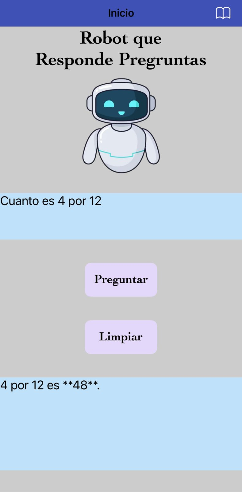

# 📱 Chatbot App

## ¿Qué es esta app?
Chatbot es una aplicación móvil creada con MIT App Inventor 2 como parte del curso de **Introducción a Ciencia de Datos con Tecnolochicas**.

La app permite al usuario hacer preguntas sobre cualquier tema y obtener respuestas generadas por **inteligencia artificial** mediante la **API de Gemini de Google AI Studio**.

---

## Cómo interactúa el usuario
- Escribir una pregunta en el cuadro de texto.  
- Enviar la pregunta al chatbot.  
- Recibir la respuesta generada por IA, que se muestra en pantalla.  

---

## 🎯 Objetivo de la app
- Practicar la integración de APIs de inteligencia artificial en aplicaciones móviles.  
- Aprender a procesar texto dinámicamente y mostrar respuestas en tiempo real.  
- Implementar interacción con el usuario mediante texto, botones y componentes de visualización.  

---

## ⚙️ Funcionalidades
- Enviar preguntas al chatbot mediante **texto**.  
- Respuestas generadas por IA usando la **API de Gemini** de Google AI Studio.  
- Visualización de respuestas en pantalla.  
- Interfaz sencilla y amigable para interacción rápida.  

---

## 🧩 Lógica de funcionamiento
1. El usuario escribe una pregunta.  
2. Al presionar el botón **Preguntar**, la app envía la solicitud a la **API de Gemini**.  
3. La respuesta de la IA se muestra en el cuadro de texto de la app.  
4. Si se desea limpiar el campo de texto de la pregunta se presiona el botón **Limpiar**.  
5. Toda la lógica se implementa mediante **bloques visuales** en MIT App Inventor 2.  

---

## 📦 Archivo del proyecto (.aia)
El archivo del proyecto se incluye para revisar la estructura, componentes y bloques utilizados:  

- **Archivo:** [ChatBot.aia](Chatbot.aia)
- **Plataforma:** MIT App Inventor 2  

---

## 📸 Capturas de pantalla
  

