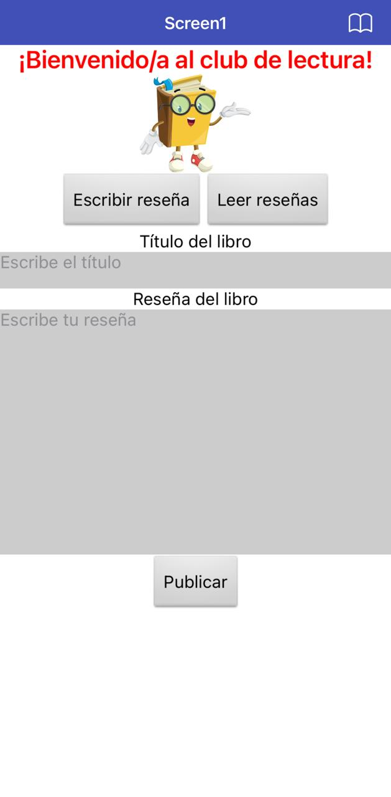
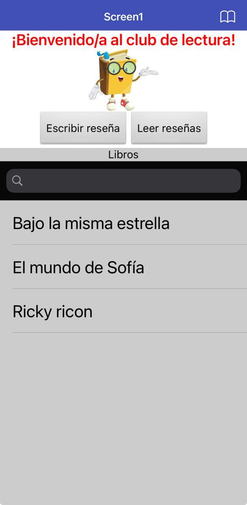
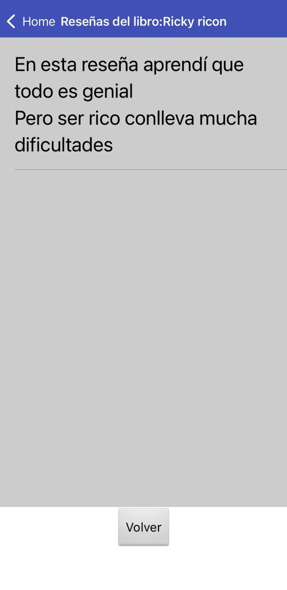

# 📚 diybookclub App

## ¿Qué es esta app?
**diybookclub** es una aplicación móvil creada con **MIT App Inventor 2** como parte del curso de **Introducción a Ciencia de Datos con Tecnolochicas**.

La app permite **crear y consultar una base de datos de reseñas de libros**, donde los usuarios pueden escribir reseñas y buscar libros que ya han sido reseñados.

---

## Cómo interactúa el usuario
- Abrir la app y elegir entre **Escribir reseña** o **Leer reseña**.  
- Al seleccionar **Escribir reseña**:  
  - Ingresar el **nombre del libro**.  
  - Escribir la **reseña**.  
  - Presionar el botón **Publicar** para guardar la información.  
- Al seleccionar **Leer reseña**:  
  - Usar el **buscador** para escribir el nombre del libro deseado.  
  - Visualizar la **lista de libros** que ya tienen reseñas publicadas.  
  - Seleccionar un libro para ver su reseña en una segunda pantalla.  

---

## 🎯 Objetivo de la app
- Practicar la **creación y gestión de bases de datos** en aplicaciones móviles.  
- Aprender a **almacenar, buscar y recuperar información** usando componentes de MIT App Inventor 2.  
- Implementar **navegación entre pantallas** y manejo de listas de datos.  

---

## ⚙️ Funcionalidades
- Crear reseñas de libros ingresando nombre y descripción.  
- Almacenar reseñas en una **base de datos interna** de la app.  
- Buscar libros por nombre mediante un **campo de búsqueda**.  
- Visualizar la lista de libros con reseñas disponibles.  
- Navegación entre pantallas para ver el detalle de cada reseña.  
- Interfaz clara y fácil de usar.  

---

## 🧩 Lógica de funcionamiento
1. En la pantalla principal, el usuario elige **Escribir reseña** o **Leer reseña**.  
2. Al escribir una reseña, la información del libro se guarda en la base de datos de la app.  
3. Al leer reseñas, la app muestra una lista con todos los libros disponibles.  
4. El usuario puede buscar un libro específico o seleccionarlo desde la lista.  
5. Al seleccionar un libro, la app navega a la segunda pantalla y muestra la reseña completa.  
6. Toda la lógica se implementa mediante **bloques visuales** en MIT App Inventor 2.  

---

## 📦 Archivo del proyecto (.aia)
El archivo del proyecto se incluye para revisar la estructura, componentes y bloques utilizados:

- **Archivo:** [DIYBookClub](DIYBookClub.aia)  
- **Plataforma:** MIT App Inventor 2  

---

## 📸 Capturas de pantalla
  
  
  

