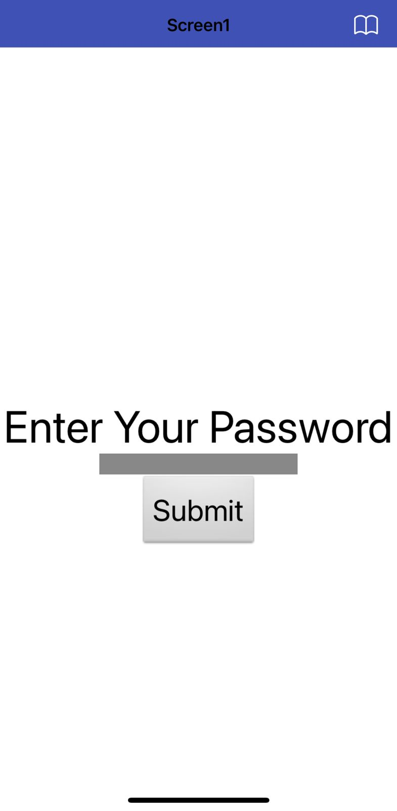
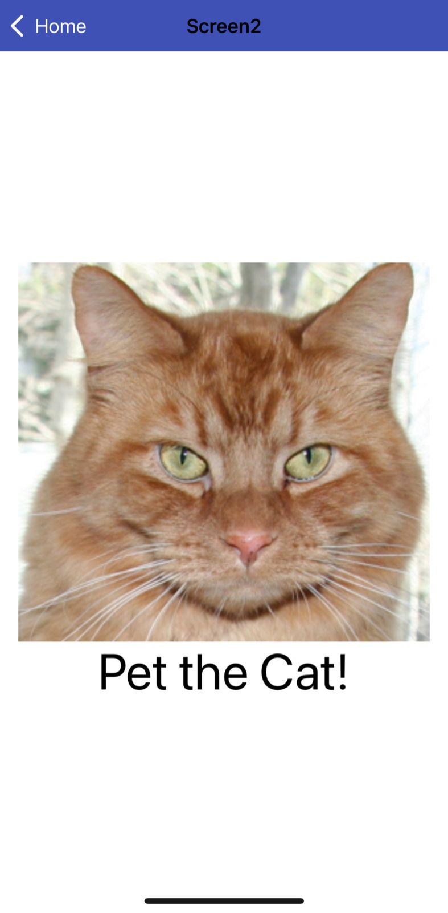

# 📱 HelloPurrStarter App

## ¿Qué es esta app?

Esta es una aplicación móvil sencilla creada con **MIT App Inventor 2** como parte del curso de **Introducción Ciencia de Datos con Tecnolochicas**. La app tiene **dos pantallas** y su propósito principal es practicar **lógica básica**, validación de entradas y manejo de eventos.

La interacción es la siguiente:

1. El usuario ingresa una contraseña y presiona un botón.
2. Si la contraseña es correcta, la app pasa a una segunda pantalla.
3. En la segunda pantalla se muestra una imagen de un gato.
4. Al hacer clic sobre la imagen, se reproduce un sonido (maullido).

---

## Objetivo de la app

* Practicar el uso de **condicionales (if / else)**.
* Aprender a **validar datos ingresados por el usuario**.
* Implementar **navegación entre pantallas**.
* Usar componentes multimedia como **imágenes y sonido**.

---

## Funcionalidades

* Campo de texto para ingresar una contraseña.
* Botón para enviar la contraseña.
* Verificación de la contraseña ingresada.
* Cambio a una segunda pantalla cuando la contraseña es correcta.
* Visualización de una imagen.
* Reproducción de un sonido al hacer clic sobre la imagen.

---

## Lógica de funcionamiento

* Cuando el usuario presiona el botón:

  * Se evalúa si el texto ingresado coincide con la contraseña definida.
  * Si la condición es verdadera, se abre la segunda pantalla.
  * Si es falsa, devuelve el campo vacío.
* En la segunda pantalla:

  * Al hacer clic sobre la imagen, se activa el componente de sonido.

Toda la lógica se implementa mediante **bloques visuales** en MIT App Inventor.

---

## 📦 Archivo del proyecto (.aia)

El archivo del proyecto de MIT App Inventor se incluye para permitir revisar la estructura, componentes y bloques utilizados en la app.

- **Archivo:** [PasswordSoundApp.aia](HelloPurrStarter.aia)
- **Plataforma:** MIT App Inventor 2

## 📸 Capturas de pantalla

**Pantalla 1 – Ingreso de contraseña**

**Pantalla 2 – Imagen y sonido**

