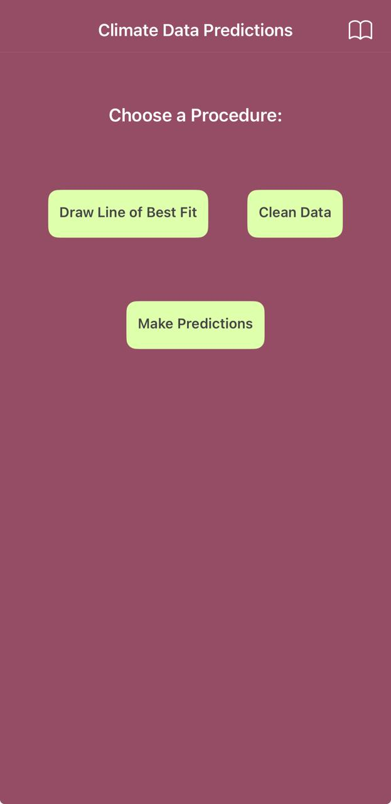
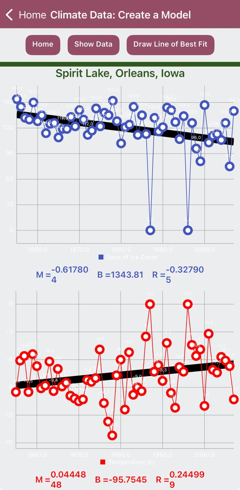
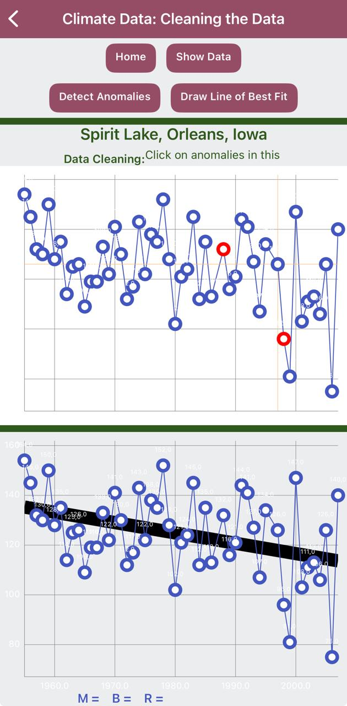
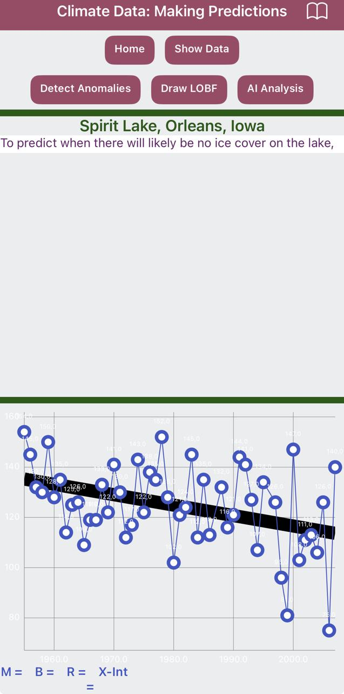

# ❄️ icemelt-project App

## ¿Qué es esta app?
**icemelt-project** es una aplicación móvil creada con **MIT App Inventor 2** como proyecto de clase del curso de **Introducción a Ciencia de Datos con Tecnolochicas**.

La app se basa en el análisis de datos históricos sobre los días en que un lago permanece congelado durante el invierno. A partir de estos registros, la aplicación permite **visualizar tendencias, limpiar datos atípicos y realizar predicciones** sobre futuros días de buen patinaje, utilizando herramientas de análisis de datos e inteligencia artificial.

El proyecto sigue la historia de Selena, quien desea saber cuántos días de buen hielo tendrá su lago local en los próximos inviernos.

---

## Cómo interactúa el usuario
En la pantalla principal, el usuario puede elegir entre tres acciones:

- **Dibujar la línea de mejor ajuste**  
  Muestra los datos históricos junto con la línea de mejor ajuste para visualizar la tendencia a lo largo del tiempo.

- **Limpiar data**  
  Elimina datos atípicos o anomalías para mejorar la calidad del análisis.

- **Hacer predicciones**  
  Permite solicitar una predicción sobre futuros días de congelamiento, usando una **API de OpenAI** para generar la respuesta.

---

## 🎯 Objetivo de la app
- Aplicar conceptos de **ciencia de datos** en una aplicación móvil real.  
- Analizar datos históricos para identificar **tendencias a largo plazo**.  
- Practicar la **visualización de datos**, limpieza de datos y predicción.  
- Integrar **inteligencia artificial** para apoyar la interpretación de resultados y predicciones futuras.  

---

## ⚙️ Funcionalidades
- Visualización de datos históricos de días de congelamiento del lago.  
- Dibujo de la **línea de mejor ajuste** para análisis de tendencia.  
- Limpieza de **datos atípicos o anómalos**.  
- Predicción de futuros días de buen hielo mediante **API de OpenAI**.  
- Interfaz clara y orientada al análisis de datos.  

---

## 🧩 Lógica de funcionamiento
1. La app carga los datos históricos de días de congelamiento del lago.  
2. El usuario puede visualizar los datos junto con la **línea de mejor ajuste**.  
3. Si lo desea, puede limpiar los datos eliminando valores atípicos.  
4. Al seleccionar **Hacer predicciones**, la app envía la información a la **API de OpenAI**.  
5. La respuesta generada se muestra en pantalla como una estimación futura.  
6. Toda la lógica se implementa mediante **bloques visuales** en MIT App Inventor 2.  

---

## 📦 Archivo del proyecto (.aia)
El archivo del proyecto se incluye para revisar la estructura, componentes y bloques utilizados:

- **Archivo:** [icemelt-project.aia](icemelt_predictions.aia)  
- **Plataforma:** MIT App Inventor 2  

---

## 📸 Capturas de pantalla

