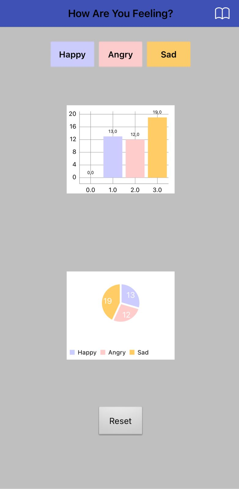

# 😊 Track My Mood App

## ¿Qué es esta app?
**Track My Mood** es una aplicación móvil creada con **MIT App Inventor 2** como parte del curso de **Introducción a Ciencia de Datos con Tecnolochicas**.

La app permite al usuario **registrar su estado de ánimo** (Happy, Angry o Sad) y visualizar la información acumulada mediante **gráficas de barras y de tarta**.  

---

## Cómo interactúa el usuario
- Abrir la app y seleccionar su **estado de ánimo actual** (Happy, Angry o Sad).  
- El registro se acumula automáticamente en la base de datos de la app.  
- Visualizar los registros acumulados en dos tipos de gráficas:  
  - **Gráfica de barras**  
  - **Gráfica de tarta**  

---

## 🎯 Objetivo de la app
- Practicar la **captura y registro de datos** de manera interactiva en aplicaciones móviles.  
- Aprender a mostrar información mediante **visualizaciones gráficas** en MIT App Inventor 2.  
- Implementar la **interacción con el usuario** mediante botones y componentes de visualización de datos.  

---

## ⚙️ Funcionalidades
- Registrar el estado de ánimo actual: **Happy, Angry o Sad**.  
- Almacenar los registros de manera acumulativa.  
- Visualizar los registros en **gráfica de barras**.  
- Visualizar los registros en **gráfica de tarta**.  
- Interfaz sencilla y amigable para seguimiento rápido del estado de ánimo.  

---

## 🧩 Lógica de funcionamiento
1. El usuario selecciona su estado de ánimo en la app.  
2. La app actualiza las **gráficas** para mostrar la distribución de los estados de ánimo acumulados.  
3. La visualización incluye tanto **gráfica de barras** como **gráfica de tarta**.  
4. Toda la lógica se implementa mediante **bloques visuales** en MIT App Inventor 2.  

---

## 📦 Archivo del proyecto (.aia)
El archivo del proyecto se incluye para revisar la estructura, componentes y bloques utilizados:  

- **Archivo:** [TrackMyMood.aia](MoodTracker.aia)
- **Plataforma:** MIT App Inventor 2  

---

## 📸 Capturas de pantalla
  

