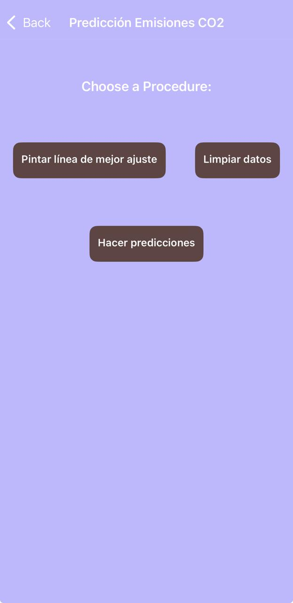
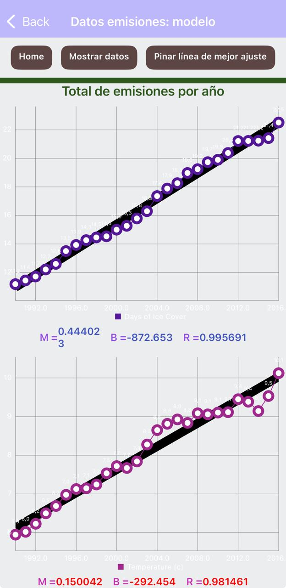
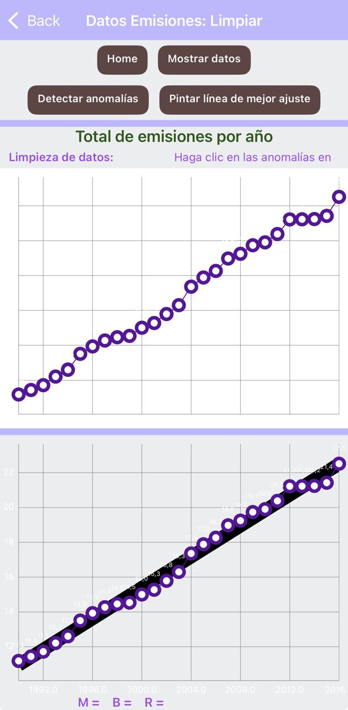
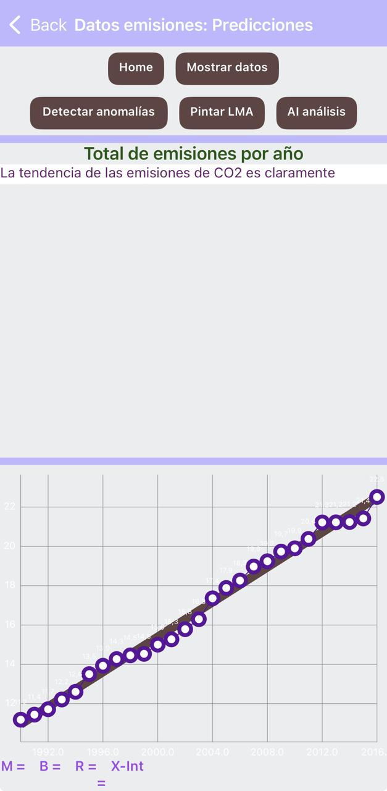

# 📱 Emisiones – Data Analysis App

## ¿Qué es esta app?
**Emisiones** es una aplicación móvil desarrollada con **MIT App Inventor 2** como proyecto final del curso de **Introducción a Ciencia de Datos con Tecnolochicas**.

La app permite analizar un **conjunto de datos históricos sobre emisiones de CO₂ equivalente del sector transporte**, identificar tendencias a lo largo del tiempo y generar una **predicción razonada** apoyada en inteligencia artificial.

---

## 📊 Contexto del análisis
El análisis se basa en un conjunto de datos que registra las **emisiones de CO₂ equivalente (CO₂-e)** producidas por el sector transporte a lo largo de varios años.

El dataset incluye:
- **Año**
- **Categorías de transporte** (carro, navegación, aviación, otros)
- **Emisiones de CO₂-e**

Para este proyecto, las emisiones se **agregan por año**, sumando todas las categorías de transporte, con el fin de estudiar la **tendencia general del sector** a lo largo del tiempo.

---

## ❓ Pregunta de investigación
> **¿Cuál es la tendencia temporal de las emisiones totales de CO₂ equivalente del sector transporte y qué se puede inferir sobre su comportamiento futuro si las condiciones actuales se mantienen?**

---

## 🎯 Objetivo de la app
- Analizar datos históricos mediante visualización gráfica.
- Identificar tendencias usando una **línea de mejor ajuste**.
- Utilizar inteligencia artificial para generar una **predicción** basada en la tendencia observada.

---

## ⚙️ Funcionalidades
- Visualización de datos históricos en una **gráfica de dispersión**.
- Dibujo de la **línea de mejor ajuste** para identificar la tendencia.
- Limpieza de datos atípicos o anómalos, si lo hay.
- Predicción mediante **IA**, basada en la tendencia mostrada en la gráfica.
- Interfaz sencilla para explorar datos y resultados.

---

## 🧩 Lógica de funcionamiento
1. La app carga los datos históricos de emisiones.
2. Los datos se agregan por año, sumando todas las categorías de transporte.
3. El usuario puede:
   - Dibujar la línea de mejor ajuste.
   - Limpiar datos atípicos si los hay.
   - Solicitar una predicción.
4. Al solicitar la predicción, la app envía a la IA una pregunta basada en la **tendencia observada en la gráfica**.
5. La IA devuelve una interpretación razonada sobre el comportamiento futuro de las emisiones.

Toda la lógica se implementa mediante **bloques visuales** en MIT App Inventor 2.

---

## 🤖 Uso de Inteligencia Artificial
La inteligencia artificial no realiza cálculos numéricos ni genera nuevos datos.  
Su función es **interpretar la tendencia observada** en los datos históricos y ofrecer una **predicción**, asumiendo que las condiciones actuales se mantienen.

Este enfoque refuerza el uso responsable de la IA como herramienta de **apoyo al razonamiento**, no como sustituto del análisis de datos.

---

## 📦 Archivo del proyecto (.aia)
El archivo del proyecto se incluye para revisar la estructura, componentes y bloques utilizados:

- **Archivo:** [emisiones-predicciones.aia](emisiones-predicciones.aia)  
- **Plataforma:** MIT App Inventor 2  

---

## 📸 Capturas de pantalla
  
  
 
  
